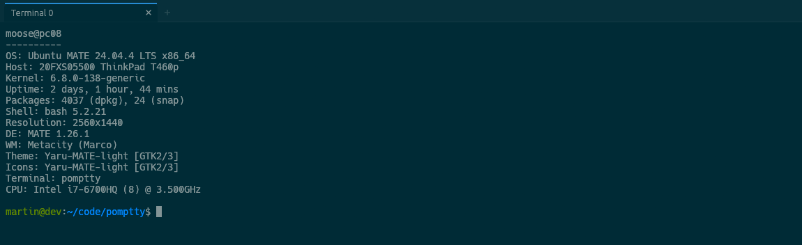

# pomptty

[](https://github.com/MartinThoma/pomptty/actions/workflows/ci.yml)
[](LICENSE)

A minimal, Chrome-flavored terminal emulator for Linux: GPU-rendered, tabbed, and
driven by a single JSON config file that reloads as you edit it.



pomptty is written in Rust on [`egui`](https://github.com/emilk/egui) +
[`egui_term`](https://github.com/Harzu/egui_term), which wraps
[`alacritty_terminal`](https://github.com/alacritty/alacritty) for VT parsing and
the PTY. Linux is the only supported platform today; macOS and Windows are on the
[roadmap](ROADMAP.md).

## Contents

- [Features](#features)
- [Installation](#installation)
- [Usage](#usage)
- [Shell integration](#shell-integration)
- [Configuration](#configuration)
- [Development](#development)
- [Roadmap](#roadmap)
- [License](#license)

## Features

- **Tabs** — open, close, switch, and drag-to-reorder by keyboard or mouse; each
  tab shows the title set by the shell (OSC 0/2), the window title follows the
  active tab, and a new tab opens in the active tab's working directory.
- **Live configuration reload** — save `config.json` and the change applies
  immediately (or press <kbd>Ctrl</kbd>+<kbd>Shift</kbd>+<kbd>R</kbd>). A
  malformed file is never overwritten: the last good config is kept and the error
  is shown.
- **Theming** — four builtins (Solarized Dark/Light, plain dark/light) or a full
  inline palette. The surrounding UI is tinted to match the terminal background.
- **Layered keybindings** — your bindings sit on top of the defaults, so new
  default shortcuts appear automatically and any default can be switched off.
- **Fuzzy history search** (<kbd>Ctrl</kbd>+<kbd>R</kbd>) — an overlay ranked by
  relevance, recency and frequency, showing each command's directory, exit
  status and age; opt-in via a [one-line shell hook](#shell-integration).
- Font zoom, scrollback keys, and clear-screen.
- Mouse selection with copy/paste
  (<kbd>Ctrl</kbd>+<kbd>Shift</kbd>+<kbd>C</kbd> /
  <kbd>Ctrl</kbd>+<kbd>Shift</kbd>+<kbd>V</kbd>).
- Custom font from a file path.
- A confirmation prompt before closing a tab that still has a process running.

## Installation

### Prerequisites

- A current stable **Rust** toolchain (2024 edition). Install it with
  [rustup](https://rustup.rs/); a distro-packaged `cargo` is often too old.
- A working GPU stack at run time: Vulkan or OpenGL, plus the X11 or Wayland
  client libraries. pomptty loads these dynamically, and a typical desktop
  already has them.

### Build and run

```sh
git clone https://github.com/MartinThoma/pomptty
cd pomptty
cargo run --release
```

The first run writes a default `config.json` (see [Configuration](#configuration))
and starts your `$SHELL`.

### Make targets

The `Makefile` prepends `~/.cargo/bin` to `PATH`, which is handy when the system
`cargo` shadows the rustup one:

| Target | Action |
|---|---|
| `make run` | debug build, then run |
| `make build` | debug build |
| `make release` | optimized build |
| `make test` | run the test suite |
| `make lint` | `rustfmt --check` + `clippy -D warnings` |
| `make fmt` | format the source |

## Usage

### Keybindings

A binding maps a **chord** to an **action**. Chords are written like
`ctrl+shift+t`, `ctrl+plus`, or `shift+pageup`; the modifiers are `ctrl`,
`shift`, `alt`, and `super`.

Your `keybindings` block is **layered on the built-in defaults**: an entry
overrides or adds a chord, future default shortcuts appear without regenerating
the file, and binding a chord to `"disabled"` removes a default
(e.g. `"ctrl+r": "disabled"`).

| Action | Default | Notes |
|---|---|---|
| `copy` / `paste` | `ctrl+shift+c` / `ctrl+shift+v` | handled by the terminal widget |
| `font-increase` | `ctrl+plus`, `ctrl+equals` | |
| `font-decrease` | `ctrl+minus` | |
| `font-reset` | `ctrl+0` | |
| `scroll-page-up` / `scroll-page-down` | `shift+pageup` / `shift+pagedown` | |
| `scroll-to-top` / `scroll-to-bottom` | `shift+home` / `shift+end` | |
| `clear` | `ctrl+shift+k` | sends <kbd>Ctrl</kbd>+<kbd>L</kbd> to the shell |
| `reload-config` | `ctrl+shift+r` | |
| `new-tab` | `ctrl+shift+t` | |
| `close-tab` | `ctrl+shift+w` | closing the last tab quits |
| `next-tab` / `prev-tab` | `ctrl+tab` / `ctrl+shift+tab` (also `ctrl+shift+pagedown` / `pageup`) | wraps around |
| `goto-tab-1` … `goto-tab-9` | `ctrl+1` … `ctrl+9` | jump to that tab; `goto-tab-9` is the last tab |
| `history-search` | `ctrl+r` | opens the fuzzy history overlay (see [Shell integration](#shell-integration)); falls through to the shell when `history.enabled` is `false` |
| `disabled` | — | suppresses a default binding |

### Mouse

- Click a tab to focus it; click `×` or middle-click to close it; click `+` to
  open a new one.
- Drag a tab sideways to reorder it.
- Click and drag inside the terminal to select; selected text is available to
  copy.

### Closing a busy tab

Closing a tab that still has a child process running in it (an editor, `ssh`, a
build) asks for confirmation first. If that process exits while the prompt is
open, the tab closes as originally requested.

## Shell integration

pomptty records command history through a **shell hook** rather than by scraping
the terminal, so nothing is recorded until you opt in. Add one line to your
shell's rc file:

```sh
# ~/.bashrc  /  ~/.zshrc
eval "$(pomptty --print-integration bash)"   # or: zsh

# ~/.config/fish/config.fish
pomptty --print-integration fish | source
```

The hook only does anything inside pomptty (it checks for `$POMPTTY`), and it
leaves `$?` untouched. For each command it appends one line — start time,
duration, exit code, working directory, and the command — to
`$POMPTTY_HISTORY_DIR/<shell-pid>.log`
(`~/.local/state/pomptty/history/` by default).

Press <kbd>Ctrl</kbd>+<kbd>R</kbd> (or click the &#9906; in the tab strip) to
search it:

| Key | Action |
|---|---|
| type | fuzzy-filter; results rank by relevance, then recency and frequency |
| <kbd>↑</kbd> / <kbd>↓</kbd>, <kbd>Ctrl</kbd>+<kbd>P</kbd> / <kbd>Ctrl</kbd>+<kbd>N</kbd> | move the selection |
| <kbd>Tab</kbd> | toggle "this directory only" |
| <kbd>Enter</kbd> | put the command on the prompt |
| <kbd>Ctrl</kbd>+<kbd>Enter</kbd> | put it on the prompt and run it |
| <kbd>Esc</kbd> | close |

Set `"history": { "enabled": false }` to disable the overlay and let
<kbd>Ctrl</kbd>+<kbd>R</kbd> reach the shell's own reverse-i-search instead.

## Configuration

On first run, pomptty writes a default config to
`$XDG_CONFIG_HOME/pomptty/config.json` (usually `~/.config/pomptty/config.json`)
and generates it again if you delete it. Every field has a default, so a partial
file — even `{}` — is valid, and unknown fields are ignored.

[`config.example.json`](config.example.json) is a complete, commented-by-example
config.

| Field | Meaning |
|---|---|
| `font_family` | Path to a `.ttf`/`.otf`/`.ttc` file, **or** the name of an installed font family (case-insensitive). `null` uses the bundled monospace face. |
| `font_size` | Terminal font size, in points. Zooming with the keyboard writes the new size back here. |
| `scrollback_lines` | Reserved; not yet wired to the backend. |
| `shell` | Shell to launch, or `null` for `$SHELL` (falling back to `/bin/bash`). |
| `shell_args` | Extra arguments for the shell. |
| `theme` | A builtin name or an inline palette object (see below). |
| `keybindings` | Map of chord → action (see [Keybindings](#keybindings)). |
| `window` | `width` / `height` in logical pixels, and `decorations`: `"custom"` (default) — frameless, pomptty's own tab strip is the title bar — or `"system"` to keep the OS title bar (use it if your WM handles a borderless window poorly; takes effect on restart). |
| `history` | `enabled` (default `true`) — whether <kbd>Ctrl</kbd>+<kbd>R</kbd> opens the overlay (see [Shell integration](#shell-integration)); `max_results` (default `50`) — rows shown at once. |

pomptty automatically adds an installed **Nerd Font / Powerline** font to the
fallback chain, so powerline prompts and devicon themes render their icons rather
than boxes — install one if you use such a prompt. Ligatures and per-glyph
bold/italic aren't rendered yet (a terminal-backend limitation).

The terminal **bell** (`\a`) flashes the window briefly, and flags the taskbar
for attention if the window isn't focused.

### Theme

Set `theme` to a builtin name:

```json
"theme": "solarized-dark"
```

`"solarized-dark"` (default), `"solarized-light"`, `"default-dark"`, and
`"default-light"` are available.

Or provide an inline palette. The generated config does this with the full
Solarized Dark palette so every color is right there to edit:

```json
"theme": {
  "foreground": "#839496",
  "background": "#002b36",
  "cursor": "#93a1a1",
  "black": "#073642",
  "red": "#dc322f"
}
```

Recognized keys are `foreground`, `background`, `cursor`, and the 16 ANSI colors
(`black`…`white`, `bright_black`…`bright_white`). Any subset works; omitted colors
fall back to Solarized Dark.

## Development

```sh
make test      # cargo test
make lint      # rustfmt --check + clippy (warnings denied)
```

[GitHub Actions](.github/workflows/ci.yml) runs formatting, Clippy, the test
suite, and a release build on every push and pull request.

Source layout:

| Path | Contents |
|---|---|
| `src/app.rs` | the eframe app: tabs, event loop, dispatch |
| `src/config/` | config loading, themes, keybindings |
| `src/terminal/` | one PTY-backed terminal tab |
| `src/ui/` | the tab strip, history overlay, and other chrome |
| `src/history/` | the shell-integration hook, log format, and history store |

Contributions are welcome. Please run `make fmt lint test` before opening a pull
request.

## Roadmap

See [ROADMAP.md](ROADMAP.md). Up next (M4/M5): a design pass on the chrome, and
command *blocks* — navigable, foldable, rerunnable prompt→output units.

## License

Released under the MIT License. See [LICENSE](LICENSE).
