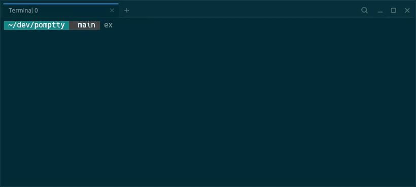

# pomptty

[](https://github.com/MartinThoma/pomptty/actions/workflows/ci.yml)
[](https://github.com/MartinThoma/pomptty/releases)
[](LICENSE)

**pomptty** is a GPU-rendered terminal with a browser's manners: a command
palette, real tabs, session restore, and a look that's sharp out of the box —
all from one JSON file that reloads the moment you save it. No account, no
telemetry, no AI.



Written in Rust on [`egui`](https://github.com/emilk/egui) + a vendored fork of
[`egui_term`](https://github.com/Harzu/egui_term), which wraps
[`alacritty_terminal`](https://github.com/alacritty/alacritty) for VT parsing
and the PTY. **Linux** and **Windows** are supported; **macOS** builds and runs
but hasn't had a hands-on pass. A few features are still Linux/macOS-only — see
[Known issues](ROADMAP.md#known-issues).

## Contents

- [Highlights](#highlights)
- [How it compares](#how-it-compares)
- [Installation](#installation)
- [Usage](#usage)
- [Shell integration](#shell-integration)
- [Configuration](#configuration)
- [Development](#development)
- [Security](#security)
- [Roadmap](#roadmap)
- [License](#license)

## Highlights

### A browser-shaped workflow

- **Command palette** (<kbd>Ctrl</kbd>+<kbd>Shift</kbd>+<kbd>P</kbd>) — one
  fuzzy input over four ranked sources at once: actions (each shown with its
  shortcut), open tabs, shell history, and recent directories.
  <kbd>Enter</kbd> runs the action, switches tab, drops the command on the
  prompt, or `cd`s there.
- **Tabs** — open, close, switch, drag-to-reorder; rename, duplicate, colour,
  and reopen-closed from the right-click menu; a fuzzy tab switcher
  (<kbd>Ctrl</kbd>+<kbd>Shift</kbd>+<kbd>A</kbd>). A new tab starts in the
  active tab's directory.
- **Session restore** — quit or crash, relaunch, and the same tabs come
  back: same directories, order, active tab, and renames.

### One config file

- A single **`config.json`** that applies the instant you save it (or
  <kbd>Ctrl</kbd>+<kbd>Shift</kbd>+<kbd>R</kbd>). A malformed file is reported,
  never overwritten.
- **Keybindings layer on the defaults** — override, add, or `"disabled"` any
  chord; or bind a chord straight to bytes / an escape sequence with
  `key_sends`.
- **Themes** — four builtins or a full inline palette, with the surrounding
  chrome tinted to match. Apps recolour the palette at runtime (OSC
  4/10/11/12), so neovim colorschemes take hold.

### A terminal that renders well

- **Box-drawing, block, shade and Powerline glyphs drawn by pomptty** —
  pixel-perfect joins at any size or font, no patched font needed.
- Real **bold / italic** faces; **underline** (single, double, undercurl,
  dotted, dashed, with `\e[58m` colour) and **strikethrough** — LSP squiggles
  render.
- A themed, gliding cursor; automatic **Nerd Font fallback** for icon glyphs;
  **OSC 8 hyperlinks** (plain-hover underline, <kbd>Ctrl</kbd>+click opens);
  optional dimmed **wallpaper** and, off X11, window **translucency**.

### History & clipboard

- An **opt-in shell hook** feeds a fuzzy <kbd>Ctrl</kbd>+<kbd>R</kbd> history
  search ranked by relevance, recency and frequency — scoped to "this
  directory" on a keypress.
- A **desktop notification** when a long-running command finishes while
  you're not looking.
- **Select-to-copy** and middle-click paste (X11 primary selection);
  bracketed paste with a multi-line confirm; **OSC 52** to copy out of
  `tmux` / `vim` over SSH; <kbd>Ctrl</kbd>+<kbd>Alt</kbd>+drag for a column.

### Careful about the basics

- Asks before closing a tab that still has a process running in it.
- A **red border** while the shell — or `sudo -s` / `su` under it — is
  running as `root`.
- No network, no telemetry, no auto-update; runs entirely as your user.
  [SECURITY.md](SECURITY.md) spells out every file it touches and how to
  verify the rest.

## How it compares

pomptty is far younger and smaller than any of these, and the mature options
do plenty it doesn't (splits, ligatures, inline images, scrollback search).
The table is about *shape* — where pomptty leans is a built-in workflow layer
(command palette, ranked history, session restore) over a plain JSON file,
rather than a scripting config or a multiplexer.

| | pomptty | [Alacritty](https://alacritty.org/) | [kitty](https://sw.kovidgoyal.net/kitty/) | [WezTerm](https://wezfurlong.org/wezterm/) | [Ghostty](https://ghostty.org/) |
|---|:---:|:---:|:---:|:---:|:---:|
| Engine | Rust · egui/wgpu | Rust · GL | C/Python · GL | Rust · wgpu | Zig · native |
| Config | JSON | TOML | `kitty.conf` | Lua | `ghostty` |
| Live config reload | auto | auto | keybind | auto | keybind |
| Tabs | ✅ | ❌ *(use tmux/WM)* | ✅ | ✅ | ✅ |
| Splits / panes | ❌ *(planned)* | ❌ | ✅ | ✅ | ✅ |
| Command palette | ✅ | ❌ | ❌ | ✅ | ✅ |
| Fuzzy <kbd>Ctrl</kbd>+<kbd>R</kbd> history | ✅ *(ranked, dir-scoped)* | ❌ | ❌ | ❌ | ❌ |
| Session restore | ✅ built-in | ❌ | ✅ | plugin | OS-level *(macOS)* |
| Styled underlines / undercurl | ✅ | ✅ | ✅ | ✅ | ✅ |
| Ligatures | ❌ | ❌ | ✅ | ✅ | ✅ |
| Inline images (sixel / kitty) | ❌ | ❌ | ✅ | ✅ | ✅ |
| Scrollback search | ❌ | ✅ | ✅ | ✅ | ❌ |
| Platforms | Linux, Windows <sup>†</sup> | Linux, macOS, Windows | Linux, macOS | Linux, macOS, Windows | Linux, macOS |
| License | MIT | Apache-2.0 | GPL-3.0 | MIT | MIT |

<sup>†</sup> macOS builds and runs but hasn't had a hands-on pass.

## Installation

**Prebuilt:** a `.deb`, an `.rpm`, a Windows `.exe` and a macOS tarball are
attached to every
[GitHub Release](https://github.com/MartinThoma/pomptty/releases).

**From source:** with a [rustup](https://rustup.rs/) toolchain,

```sh
git clone https://github.com/MartinThoma/pomptty && cd pomptty
cargo run --release
```

The first run writes a default `config.json` (see
[Configuration](#configuration)) and starts your `$SHELL`.

### Prerequisites

Building needs a **current stable Rust** (2024 edition) — a distro-packaged
`cargo` is often too old. At run time pomptty needs a GPU stack (Vulkan or
OpenGL on Linux, plus the X11 / Wayland client libraries; DirectX or Vulkan on
Windows) — loaded dynamically, and already present on a typical desktop.

pomptty asks for a **low-power** GPU (usually the integrated one) — a terminal
doesn't need a discrete card, and small dedicated GPUs can run out of VRAM.
The chosen adapter is printed at startup (`GPU: …`); `WGPU_POWER_PREF=high` or
`WGPU_BACKEND=vulkan|gl|dx12` override it.

### Make targets

The `Makefile` prepends `~/.cargo/bin` to `PATH`, which is handy when the system
`cargo` shadows the rustup one:

| Target | Action |
|---|---|
| `make run` | debug build, then run |
| `make build` | debug build |
| `make release` | optimized build |
| `make test` | run the test suite |
| `make lint` | `rustfmt --check` + `clippy -D warnings` |
| `make fmt` | format the source |
| `make windows` | cross-compile a release `pomptty.exe` from Linux — needs the `mingw-w64` linker (`sudo apt install mingw-w64` on Debian/Ubuntu) installed once; the `x86_64-pc-windows-gnu` rustup target is added automatically |
| `make deb` | build a `.deb` package (`target/debian/*.deb`); installs `cargo-deb` if missing — no sudo needed |
| `make rpm` | build an `.rpm` package (`target/generate-rpm/*.rpm`); installs `cargo-generate-rpm` if missing — no sudo needed |
| `make man` | preview the man page (`packaging/pomptty.1`) |
| `make icons` | re-rasterize the app icon from `packaging/pomptty.svg` |

Cutting a release is a tag push — see [RELEASING.md](RELEASING.md).

## Usage

### Keybindings

A binding maps a **chord** to an **action**. Chords are written like
`ctrl+shift+t`, `ctrl+plus`, or `shift+pageup`; the modifiers are `ctrl`,
`shift`, `alt`, and `super`.

Your `keybindings` block is **layered on the built-in defaults**: an entry
overrides or adds a chord, future default shortcuts appear without regenerating
the file, and binding a chord to `"disabled"` removes a default
(e.g. `"ctrl+r": "disabled"`). The command palette lists every action with
its current shortcut.

| Action | Default | Notes |
|---|---|---|
| `copy` / `paste` | `ctrl+shift+c` / `ctrl+shift+v` | handled by the terminal widget |
| `font-increase` | `ctrl+plus`, `ctrl+equals` | |
| `font-decrease` | `ctrl+minus` | |
| `font-reset` | `ctrl+0` | |
| `scroll-page-up` / `scroll-page-down` | `shift+pageup` / `shift+pagedown` | |
| `scroll-to-top` / `scroll-to-bottom` | `shift+home` / `shift+end` | |
| `clear` | `ctrl+shift+k` | sends <kbd>Ctrl</kbd>+<kbd>L</kbd> to the shell |
| `reload-config` | `ctrl+shift+r` | |
| `new-tab` | — | not bound by default (`reopen-tab` covers `ctrl+shift+t`); bind it yourself for a guaranteed-new tab |
| `reopen-tab` | `ctrl+shift+t` | reopens the last closed tab (old slot, same directory); opens a plain new tab when there's nothing to reopen |
| `close-tab` | `ctrl+w`, `ctrl+shift+w` | closing the last tab quits. `ctrl+w` shadows the shell's "delete word" — rebind it to `"disabled"` if you'd rather keep that |
| `next-tab` / `prev-tab` | `ctrl+tab` / `ctrl+shift+tab` (also `ctrl+shift+pagedown` / `pageup`) | wraps around |
| `goto-tab-1` … `goto-tab-9` | `ctrl+1` … `ctrl+9` | jump to that tab; `goto-tab-9` is the last tab |
| `tab-search` | `ctrl+shift+a` | fuzzy switcher over the open tabs |
| `history-search` | `ctrl+r` | opens the fuzzy history overlay (see [Shell integration](#shell-integration)); falls through to the shell when `history.enabled` is `false` |
| `omnibox` | `ctrl+shift+p` | command palette: actions, tabs, history and recent directories in one ranked list |
| `window-maximize` / `window-restore` | — | also in the palette as "View: Maximize / Restore Window" |
| `window-left-half` / `window-right-half` | — | un-maximize and tile the window to that half of the screen; "View: Move to Left / Right Half" |
| `open-scrollback` | — | dump the active tab's scrollback to a temp file and open it in your default editor; "Terminal: Open Scrollback in Editor" |
| `about` | — | show the version / repository / license dialog; "Help: About pomptty" |
| `disabled` | — | suppresses a default binding |

To send a raw byte string or escape sequence to the shell instead of running
an action, use the separate **`key_sends`** map — chord → string, where the
string understands `\e` / `\x1b`, `\xNN`, `\u{NNNN}`, `\n`, `\r`, `\t`, `\0`
and `\\`:

```json
"key_sends": { "alt+left": "b", "alt+right": "f", "ctrl+alt+k": "\u{1b}[1;5D" }
```

A chord listed in both `keybindings` and `key_sends` runs the action.

### Mouse

- Click a tab to focus it; click `×` or middle-click to close it; click `+` to
  open a new one.
- Drag a tab sideways to reorder it.
- Right-click a tab for rename, duplicate, close others, a "reopen closed"
  submenu, and a color (a stripe on the tab — 8 fixed swatches, or "None").
- Click and drag inside the terminal to select; selected text is available to
  copy.

### Closing a busy tab

Closing a tab that still has a child process running in it (an editor, `ssh`, a
build) asks for confirmation first. If that process exits while the prompt is
open, the tab closes as originally requested.

## Shell integration

pomptty records command history through a **shell hook** rather than by scraping
the terminal, so nothing is recorded until you opt in. Add one line to your
shell's rc file:

```sh
# ~/.bashrc  /  ~/.zshrc
eval "$(pomptty --print-integration bash)"   # or: zsh

# ~/.config/fish/config.fish
pomptty --print-integration fish | source
```

The hook only does anything inside pomptty (it checks for `$POMPTTY`), and it
leaves `$?` untouched. For each command it appends one line — start time,
duration, exit code, working directory, and the command — to
`$POMPTTY_HISTORY_DIR/<shell-pid>.log`
(`~/.local/state/pomptty/history/` by default).

Press <kbd>Ctrl</kbd>+<kbd>R</kbd> (or click the &#9906; in the tab strip) to
search it:

| Key | Action |
|---|---|
| type | fuzzy-filter; results rank by relevance, then recency and frequency |
| <kbd>↑</kbd> / <kbd>↓</kbd>, <kbd>Ctrl</kbd>+<kbd>P</kbd> / <kbd>Ctrl</kbd>+<kbd>N</kbd> | move the selection |
| <kbd>Tab</kbd> | toggle "this directory only" |
| <kbd>Enter</kbd> | put the command on the prompt |
| <kbd>Ctrl</kbd>+<kbd>Enter</kbd> | put it on the prompt and run it |
| <kbd>Esc</kbd> | close |

Set `"history": { "enabled": false }` to disable the overlay and let
<kbd>Ctrl</kbd>+<kbd>R</kbd> reach the shell's own reverse-i-search instead.

## Configuration

On first run, pomptty writes a default config to
`$XDG_CONFIG_HOME/pomptty/config.json` (usually `~/.config/pomptty/config.json`)
and generates it again if you delete it. Every field has a default, so a partial
file — even `{}` — is valid, and unknown fields are ignored.

[`config.example.json`](config.example.json) is a complete, commented-by-example
config.

| Field | Meaning |
|---|---|
| `font_family` | Path to a `.ttf`/`.otf`/`.ttc` file, **or** the name of an installed font family (case-insensitive). `null` uses the bundled monospace face. |
| `font_size` | Terminal font size, in points. Zooming with the keyboard writes the new size back here. |
| `bold_is_bright` | `false` by default. When `true`, bold text using one of the 8 normal palette colours is drawn with the matching bright colour (as Alacritty / kitty can). |
| `scrollback_lines` | Reserved; not yet wired to the backend. |
| `shell` | Shell to launch, or `null` for `$SHELL` (falling back to `/bin/bash`). |
| `shell_args` | Extra arguments for the shell. |
| `theme` | A builtin name or an inline palette object (see below). |
| `keybindings` | Map of chord → action (see [Keybindings](#keybindings)). |
| `key_sends` | Map of chord → raw byte string / escape sequence sent to the shell (see [Keybindings](#keybindings)). |
| `window` | `width` / `height` in logical pixels; `decorations`: `"custom"` (default) — frameless, pomptty's own tab strip is the title bar — or `"system"` to keep the OS title bar (use it if your WM handles a borderless window poorly); `opacity` (`0.05`–`1.0`, default `1.0`) — terminal-body translucency, **Wayland / macOS / Windows only** (ignored on X11); `background` — `{ "path": "…", "dim": 0.55, "vignette": 0.35 }` draws a PNG/JPEG behind the text. All take effect on restart. |
| `history` | `enabled` (default `true`) — whether <kbd>Ctrl</kbd>+<kbd>R</kbd> opens the overlay (see [Shell integration](#shell-integration)); `max_results` (default `50`) — rows shown at once. |
| `session` | `restore` (default `true`) — reopen the last run's tabs, directories and renames on launch; also stops pomptty recording them when `false`. Saved to `session.json` next to the history logs. |
| `cursor` | `shape` (default `"block"`; also `"beam"`, `"underline"`) and `blink` (default `true`) — the cursor's appearance before an app sets its own via DECSCUSR (`vim`'s insert-mode beam, for instance, still overrides this at runtime). |
| `paste` | `confirm_multiline` (default `true`) — show a confirm dialog (line count + preview) before a multi-line paste reaches the shell, where the lines run as separate commands. A trailing newline is always stripped, so a whole-line copy pastes at the prompt instead of running. |
| `notifications` | `long_command_secs` (default `300`) — post a desktop notification when a command that ran at least this long finishes while pomptty is unfocused, minimised, or on another tab; `0` disables it. Needs the [shell integration](#shell-integration). |
| `clipboard` | `osc52_read` (default `false`) — let terminal apps *read* the system clipboard via OSC 52 (`\e]52;c;?`); the *copy* direction is always allowed. Off by default, matching Alacritty. New tabs pick up a change. |
| `security` | `superuser_warning` (default `true`) — red terminal outline + tab dot while the shell (or `sudo -s` / `su` / a long `sudo …` under it) is running as `root`. Linux and macOS. |

pomptty automatically adds an installed **Nerd Font / Powerline** font to the
fallback chain, so powerline prompts and devicon themes render their icons rather
than boxes — install one if you use such a prompt. Bold and italic text render
with the real bold/italic faces of the configured family when installed
(falling back to the regular face, never a synthetic embolden/oblique, when
they aren't). Ligatures aren't rendered yet (a terminal-backend limitation).

The terminal **bell** (`\a`) flashes the window briefly, and flags the taskbar
for attention if the window isn't focused.

### Theme

Set `theme` to a builtin name:

```json
"theme": "solarized-dark"
```

`"solarized-dark"` (default), `"solarized-light"`, `"default-dark"`, and
`"default-light"` are available.

Or provide an inline palette. The generated config does this with the full
Solarized Dark palette so every color is right there to edit:

```json
"theme": {
  "foreground": "#839496",
  "background": "#002b36",
  "cursor": "#93a1a1",
  "black": "#073642",
  "red": "#dc322f"
}
```

Recognized keys are `foreground`, `background`, `cursor`, and the 16 ANSI colors
(`black`…`white`, `bright_black`…`bright_white`). Any subset works; omitted colors
fall back to Solarized Dark.

## Development

```sh
make test      # cargo test
make lint      # rustfmt --check + clippy (warnings denied)
```

[GitHub Actions](.github/workflows/ci.yml) runs formatting, Clippy, the test
suite, and a release build on every push and pull request.

Source layout:

| Path | Contents |
|---|---|
| `src/app.rs` | the eframe app: tabs, event loop, dispatch |
| `src/config/` | config loading, themes, keybindings |
| `src/terminal/` | one PTY-backed terminal tab |
| `src/ui/` | the tab strip, history/tab-search/omnibox overlays, and other chrome |
| `src/history/` | the shell-integration hook, log format, and history store |
| `src/session.rs` | session restore: what's saved, load/save |

Contributions are welcome. Please run `make fmt lint test` before opening a pull
request.

## Security

pomptty is **local-only** — no network connections, no telemetry, no
auto-update — and runs entirely as your user with no elevated privileges. Its
own code is 100% safe Rust, no `unsafe` at all (`#![deny(unsafe_code)]` with no
exceptions), and every dependency is checked for advisories, licenses and
provenance by `cargo deny` on each push.

[SECURITY.md](SECURITY.md) spells out exactly what it does, which files it
touches, and how to verify all of it, plus how to report a vulnerability.

## Roadmap

See [ROADMAP.md](ROADMAP.md). The next big piece is **M5 — command blocks**:
treating each prompt→command→output span as a unit you can fold, jump between,
copy, and rerun.

## License

Released under the MIT License. See [LICENSE](LICENSE).
